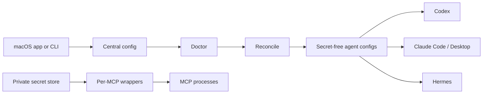

# Agent Switch

**Define each MCP once. Store each credential once. Project both into every supported local AI agent.**

[](https://github.com/JNHFlow21/agent-switch/actions/workflows/ci.yml)
[](https://www.apple.com/macos/)
[](LICENSE)

Codex, Claude Code, Claude Desktop, and Hermes each keep their own MCP
configuration. Copying the same servers and credentials into every client
creates drift and spreads secrets across files.

Agent Switch replaces those copies with one local registry, one private
credential store, and deterministic per-agent projections.

> [!IMPORTANT]
> Agent Switch is **alpha software**. Today it is installed from source and the
> macOS app is built locally; there is no signed, notarized public app, PyPI
> package, or Homebrew formula yet. See the [roadmap](docs/roadmap.md).

## Quick start

### Prerequisites

- macOS 14 or newer
- Git
- Python 3.11 or newer
- [`pipx`](https://pipx.pypa.io/)
- Full Xcode with `xcodebuild` for the native app

### Install with your coding agent

This is the recommended alpha installation path. Paste the prompt below into
Codex, Claude Code, or another local coding agent:

```text
Install and verify Agent Switch on this Mac instead of only explaining the steps.

Repository: https://github.com/JNHFlow21/agent-switch
Checkout: ~/Agent-Workspace/agent-switch

1. Read the repository README and install script first. Verify macOS 14+, Git,
   Python 3.11+, pipx, and full Xcode. Install only missing prerequisites.
2. Clone the repository at the checkout path, or update it with `git pull
   --ff-only` only when the existing worktree is clean. Never overwrite local work.
3. Install the CLI from the checkout with pipx. Run both Python test suites,
   then run `macos-app/AgentSwitch/install.sh`.
4. Initialize the config and run `agent-switch mcp import --dry-run --json`.
   Show me the detected MCP IDs, target apps, and required secret NAMES before
   adopting or writing native agent configs.
5. Run Doctor before Reconcile. Apply changes only when no target is blocked,
   then verify `agent-switch doctor --strict`, `agent-switch agents`,
   `agent-switch mcp list`, and `agent-switch secret list`.
6. Never request, print, log, or pass a secret as a command argument. Never put
   one in a project .env file. If a value is required, let me enter it in the
   app or pipe it locally to `agent-switch secret set --stdin NAME`.

Report what was installed, which agents were enrolled, missing secret NAMES
only, and any remaining action. Confirm that ~/Applications/Agent Switch.app opens.
```

Your first successful setup should produce all three results:

```text
agent-switch --version        -> agent-switch 0.2.0
agent-switch doctor --strict  -> exits successfully with no managed drift
Native app                    -> opens from ~/Applications/Agent Switch.app
```

<details>
<summary>Install manually from source</summary>

```bash
brew install python pipx
pipx ensurepath
export PATH="$HOME/.local/bin:$PATH"

mkdir -p "$HOME/Agent-Workspace"
git clone https://github.com/JNHFlow21/agent-switch.git \
  "$HOME/Agent-Workspace/agent-switch"
cd "$HOME/Agent-Workspace/agent-switch"

pipx install .
PYTHONPATH=src python3 -m unittest discover -s tests
PYTHONPATH=src python3 -m unittest discover -s tests/integration
macos-app/AgentSwitch/install.sh

agent-switch write-default-config
agent-switch mcp import --dry-run --json
agent-switch doctor
agent-switch reconcile
agent-switch doctor --strict
```

Review the import preview before using `agent-switch mcp import --adopt` on
existing agent configurations.

</details>

## What changes for you

| Before Agent Switch | With Agent Switch |
| --- | --- |
| The same MCP is configured separately in every agent | Register it once and choose its target agents |
| API keys are copied into native client configs | Values remain in one private local store |
| A changed MCP silently drifts between clients | `doctor` reports drift; `reconcile` repairs it |
| Every MCP can inherit the entire shell environment | Each wrapper injects only its declared secret names |
| Existing config migration is an all-or-nothing edit | Preview first, then explicitly adopt with backups |

New installations start with an empty registry. Agent Switch does not install
the maintainer's preferred MCPs or request unrelated credentials.

## Core workflow

```bash
# 1. Preview supported user-level stdio MCPs without changing files
agent-switch mcp import --dry-run --json

# 2. Back up native configs and explicitly adopt the previewed MCPs
agent-switch mcp import --adopt

# 3. Write a credential locally without putting its value in argv or chat
secret-producing-command | agent-switch secret set --stdin SEARCH_API_KEY

# 4. Preview health and drift, then apply the central state
agent-switch doctor
agent-switch reconcile

# 5. Require a clean managed state
agent-switch doctor --strict
```

Never replace `secret-producing-command` with a literal secret in a recorded
command. The macOS app is the simplest interactive way to enter a value.

## What Agent Switch manages

| Area | Current behavior |
| --- | --- |
| **MCP servers** | Import, add, edit, target, enable, disable, remove, and reconcile user-level command/stdio MCPs |
| **Credentials** | Store values once and grant each MCP only its declared secret names |
| **Agent policy** | Synchronize bounded instruction blocks for Codex, Claude Code, and Hermes |
| **Health** | Detect invalid config, missing secret names, unpinned `npx` packages, blocked targets, and managed drift |
| **Recovery** | Write atomically and back up native files before migration or replacement |
| **CLI inventory** | Show installed AI tools, versions, package managers, and executable paths |
| **Skills** | Inventory optional Skill Hub sources without treating download as activation |
| **CC Switch** | Preserve provider switching and mirror only Agent Switch-owned MCP rows |

## How it works



| Local source of truth | Default path |
| --- | --- |
| MCP definitions and grants | `~/.config/agent-switch/config.json` |
| Credential values | `~/.config/agent-switch/secrets.env` |
| Generated MCP wrappers | `~/.config/agent-switch/mcp/bin/` |
| Native config backups | `~/.config/agent-switch/backups/` |

Agent Switch owns only `agent-*` MCP entries and marked instruction blocks.
Unrelated provider and MCP settings are preserved.

## Supported integrations

| Integration | MCP sync | Shared policy | Inventory |
| --- | :---: | :---: | :---: |
| Codex | ✓ | ✓ | ✓ |
| Claude Code | ✓ | ✓ | ✓ |
| Claude Desktop | ✓ | — | — |
| Hermes | ✓ | ✓ | ✓ |
| CC Switch | Owned-row mirror | Provider settings preserved | Schema check |
| Skill Hub | Skill inventory/update | Explicit project/global profiles | ✓ |

A new agent requires a tested adapter. Agent Switch does not guess unknown
configuration formats.

## Credential and privacy boundaries

Agent Switch is local-first, but it is **not a password vault**.

- Credential values stay in a local mode-`0600` file, not in Git, app
  preferences, generated agent configs, or wrapper source.
- Secret writes use stdin or inherited file descriptors, never positional
  arguments.
- Secret reads refuse stdout, stderr, terminals, and aliased descriptors.
- Wrappers parse the store as data, remove inherited sensitive variables, and
  inject only the names granted to that MCP.
- Diagnostics, import previews, and audits report secret **names**, never
  values.
- Wrappers fail closed when a required secret name is missing.
- No upload service or cloud account is implemented. An MCP can still contact
  its own provider when an agent invokes it.

Read [Secrets and wrappers](docs/secrets-and-wrappers.md) and the
[Security Policy](SECURITY.md) before using sensitive credentials. Security
reports should follow the private reporting route in `SECURITY.md`, not a public
issue.

## Current alpha scope

Version 0.2 manages user-level command/stdio MCP definitions and static
credential values on macOS.

It does **not** yet provide:

- migration for native HTTP/SSE transports or OAuth sessions;
- project-scoped MCP discovery;
- automatic support for unknown agents;
- a signed and notarized downloadable app;
- published PyPI or Homebrew distribution;
- a password-manager or hardware-backed credential vault.

These are limitations, not hidden features. Planned work lives in the
[roadmap](docs/roadmap.md).

## Command reference

```bash
agent-switch agents               # detected agents and policy enrollment
agent-switch clis                 # installed AI CLI inventory
agent-switch mcp list             # central MCP registry
agent-switch secret list          # credential names only
agent-switch skills               # optional Skill Hub inventory
agent-switch doctor --json        # machine-readable health report
agent-switch reconcile --dry-run  # planned managed changes
```

Add a centrally managed MCP:

```bash
agent-switch mcp add filesystem \
  --command npx \
  --arg=-y \
  --arg=@modelcontextprotocol/server-filesystem@1.0.0 \
  --app codex \
  --app claude

agent-switch reconcile
```

See [Unified MCP Registry](docs/mcp-registry.md) for lifecycle commands and
safe import behavior.

## Update from source

```bash
cd "$HOME/Agent-Workspace/agent-switch"
git pull --ff-only
pipx uninstall agent-switch
pipx install .
PYTHONPATH=src python3 -m unittest discover -s tests
PYTHONPATH=src python3 -m unittest discover -s tests/integration
macos-app/AgentSwitch/install.sh
agent-switch doctor
```

Agent Switch does not silently update itself, third-party CLIs, or Skill
sources.

## Documentation

- [Unified MCP Registry](docs/mcp-registry.md)
- [Secrets and wrappers](docs/secrets-and-wrappers.md)
- [CC Switch compatibility](docs/ccswitch-compat.md)
- [Recovery and rollback](docs/recovery.md)
- [Roadmap](docs/roadmap.md)
- [Contributing](CONTRIBUTING.md)
- [Security Policy](SECURITY.md)

## Development

```bash
git clone https://github.com/JNHFlow21/agent-switch.git
cd agent-switch
python3 -m venv .venv
. .venv/bin/activate
python -m pip install -e .
python -m unittest discover -s tests
python -m unittest discover -s tests/integration
```

The native app lives in [`macos-app/AgentSwitch`](macos-app/AgentSwitch) and
targets macOS 14+. See [CONTRIBUTING.md](CONTRIBUTING.md) for the complete test
and privacy gate.

## License

[MIT](LICENSE) © 2026 JNHFlow21
