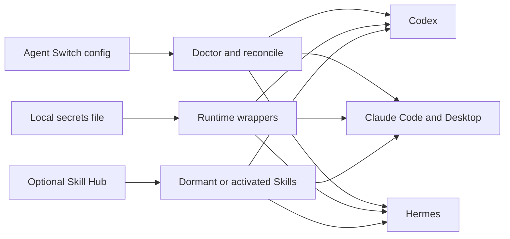

# Agent Switch

**One local control plane for AI coding agents, MCP servers, Skills, CLI tools, and secrets.**

[](https://www.apple.com/macos/)
[](https://www.python.org/)
[](LICENSE)

## 1. Install Agent Switch with your AI

Copy the prompt below into **Codex, Claude Code, or another local coding agent**. It tells the agent to install and verify Agent Switch without putting a secret in chat, shell arguments, or logs.

```text
Install Agent Switch on this Mac and complete the setup instead of only explaining it.

Repository: https://github.com/JNHFlow21/agent-switch
Canonical checkout: ~/Agent-Workspace/agent-switch

Requirements:
1. First inspect the repository README and install scripts. Verify this is macOS 14+ with Git, Python 3.11+, pipx, and a full Xcode installation with `xcodebuild`. Install only missing prerequisites with the least invasive method.
2. If the canonical checkout does not exist, clone the repository there. If it exists and is clean, update it with git pull --ff-only. Never overwrite uncommitted user work.
3. Install or refresh the Python CLI from that checkout with pipx, and make sure `agent-switch` is on PATH.
4. Run the complete Python test suite. Then build and install the native app by running `macos-app/AgentSwitch/install.sh` from the checkout.
5. Run `agent-switch write-default-config`, then `agent-switch doctor`. Explain the planned managed changes briefly and run `agent-switch reconcile` only if Doctor reports no blocked target.
6. Verify `agent-switch doctor --strict`, `agent-switch agents`, `agent-switch clis`, and `agent-switch skills` all run. Confirm that `~/Applications/Agent Switch.app` opens.
7. Never ask me to paste an API key or token into chat. Never pass a secret as a command argument, print it, or write it to a project .env file. If a secret is needed, tell me to enter it in the Agent Switch app, or pipe it to `agent-switch secret set --stdin NAME` locally.
8. Report exactly what was installed, which agents were enrolled, any missing secret NAMES only, and any action I still need to take. Do not report secret values.
```

<details>
<summary>Manual installation</summary>

```bash
brew install python pipx
pipx ensurepath
export PATH="$HOME/.local/bin:$PATH"

mkdir -p "$HOME/Agent-Workspace"
git clone https://github.com/JNHFlow21/agent-switch.git \
  "$HOME/Agent-Workspace/agent-switch"
cd "$HOME/Agent-Workspace/agent-switch"

pipx install --force .
PYTHONPATH=src python3 -m unittest discover -s tests
PYTHONPATH=src python3 -m unittest discover -s tests/integration
macos-app/AgentSwitch/install.sh

agent-switch write-default-config
agent-switch doctor
agent-switch reconcile
agent-switch doctor --strict
```

`reconcile` writes only Agent Switch-managed regions, preserves unrelated MCP and provider settings, and backs up changed files under `~/.config/agent-switch/backups/`.

</details>

## 2. What Agent Switch does

AI tools usually keep separate copies of the same environment: one MCP list for Codex, another for Claude Code, another for Hermes, different instruction files, and secrets scattered across app configs. Those copies drift.

**Agent Switch gives them one managed local environment.** You define a tool once, store each secret once, and reconcile the safe projection into every supported agent.

### Core features

| Area | What Agent Switch manages |
| --- | --- |
| **Agents** | Detects and enrolls Codex, Claude Code, and Hermes; keeps one policy synchronized through their native instruction entry points. |
| **MCP servers** | Defines `agent-*` MCP tools centrally, generates secret-loading wrappers, repairs drift, and preserves every unrelated MCP entry. |
| **Secrets** | Stores tool credentials in one local mode-`0600` file; the macOS UI can add, update, reveal, hide, copy, and delete values. |
| **Skills** | Reads an optional Skill Hub warehouse and separates dormant, project-active, global, and missing Skills. Downloading or updating a Skill never activates it. |
| **CLI tools** | Shows installed agent/tool CLIs, versions, package managers, executable paths, and Finder/file actions. |
| **Health and sync** | `doctor` previews drift; `reconcile` applies atomic, backed-up changes; the app exposes the same check-and-sync workflow. |
| **CC Switch compatibility** | Keeps CC Switch provider switching intact and mirrors only MCP rows owned by the `agent-*` namespace. |

### The operating model



- **Config is centralized:** `~/.config/agent-switch/config.json`
- **Secret values stay local:** `~/.config/agent-switch/secrets.env`
- **Generated wrappers are isolated:** `~/.config/agent-switch/mcp/bin/`
- **Existing files are backed up:** `~/.config/agent-switch/backups/`
- **Ownership is bounded:** only the `agent-*` MCP namespace and marked instruction blocks are managed.

## Supported integrations

| Integration | MCP sync | Shared policy | Status inventory |
| --- | :---: | :---: | :---: |
| Codex | ✓ | ✓ | ✓ |
| Claude Code | ✓ | ✓ | ✓ |
| Claude Desktop | ✓ | — | — |
| Hermes | ✓ | ✓ | ✓ |
| CC Switch | MCP mirror | Provider settings preserved | Schema checked |
| Skill Hub | Skill inventory/update | Project/global profiles | ✓ |

A new agent needs a dedicated adapter before Agent Switch modifies it. The project intentionally does not guess unknown config formats.

## Common commands

```bash
# Inspect without changing files
agent-switch doctor
agent-switch doctor --json

# Repair managed MCP entries, wrappers, and shared instructions
agent-switch reconcile

# Inspect local integrations
agent-switch agents
agent-switch clis
agent-switch skills

# Explicitly fetch Git-backed Skill Hub sources; this does not activate Skills
agent-switch skills update

# List secret names only
agent-switch secret list

# Write a value through a non-interactive local pipe
secret-producing-command | agent-switch secret set --stdin FIRECRAWL_API_KEY
```

Never substitute a literal secret for `secret-producing-command` in a recorded command. The macOS app is the simplest interactive way to enter or reveal a value.

## Privacy and security model

Agent Switch is local-first, but it is not a password vault:

- secret values are stored in `~/.config/agent-switch/secrets.env`, not in this repository, Git, app preferences, or generated agent configs;
- the secrets file and instruction files use restrictive local permissions;
- secret writes use stdin or inherited file descriptors instead of process arguments;
- secret reads refuse stdout, stderr, terminal, and aliased descriptors;
- the macOS app reveals a value only after an explicit eye-button click, with no Touch ID dialog;
- diagnostics and audits report secret **names**, never secret values;
- wrappers fail closed when a required secret name is missing.

Read [Secrets and wrappers](docs/secrets-and-wrappers.md), [Recovery](docs/recovery.md), and [Security Policy](SECURITY.md) before production use.

## Skill Hub: warehouse first, activation second

Skill Hub is an optional, separate Skill source/profile control plane. Set `SKILL_HUB_HOME` if its checkout is not at `~/AgentWorkspace/skill-hub`.

Agent Switch follows one rule: **downloaded does not mean enabled**.

1. A downloaded Skill enters the warehouse as **dormant**.
2. A project profile can explicitly activate it for one project.
3. Only an explicit `global` profile makes it globally available.
4. Updating a Git source refreshes code but never changes activation state.

The current app inventories and refreshes Skill Hub sources. Profile activation remains explicit through Skill Hub's `skillctl` workflow.

## Updating Agent Switch

```bash
cd "$HOME/Agent-Workspace/agent-switch"
git pull --ff-only
pipx install --force .
PYTHONPATH=src python3 -m unittest discover -s tests
PYTHONPATH=src python3 -m unittest discover -s tests/integration
macos-app/AgentSwitch/install.sh
agent-switch doctor
```

Agent Switch does not silently update itself or third-party CLIs. Skill Git sources update only when the user clicks **Update Git Sources** or runs `agent-switch skills update`.

## Frequently asked questions

### Is Agent Switch a CC Switch replacement?

No. CC Switch can continue to manage provider imports and switching. Agent Switch owns the local MCP, wrapper, secret, shared-policy, CLI-inventory, and Skill-inventory layer.

### Does Agent Switch put API keys into Codex, Claude, or Hermes config files?

No. Generated MCP entries point to local wrapper scripts. Wrappers load required values at runtime from the private local secrets file.

### Can a downloaded Skill run immediately?

No. A downloaded Skill stays dormant until it is explicitly assigned to a project or global profile.

### Does Agent Switch upload configuration or secrets?

No upload or cloud account is implemented. A configured MCP tool can still contact its own provider when an agent invokes it.

### Why run `doctor` before `reconcile`?

`doctor` validates config syntax, target schemas, wrappers, required secret names, and planned drift. Blocked targets stop `reconcile` before unsafe writes.

## Development

```bash
git clone https://github.com/JNHFlow21/agent-switch.git
cd agent-switch
python3 -m venv .venv
. .venv/bin/activate
python -m pip install -e .
python -m unittest discover -s tests
python -m unittest discover -s tests/integration
```

The native application lives in [`macos-app/AgentSwitch`](macos-app/AgentSwitch) and targets macOS 14+.

## License

[MIT](LICENSE) © 2026 JNHFlow21
