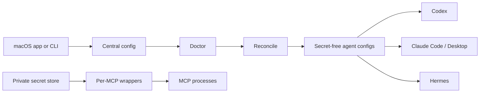

<p align="center">
  <strong>English</strong> · <a href="README.zh-CN.md">简体中文</a>
</p>

# Agent Switch

**Define each MCP once. Store each credential once. Project both into every supported local AI agent.**

[](https://github.com/JNHFlow21/agent-switch/actions/workflows/ci.yml)
[](https://www.apple.com/macos/)
[](LICENSE)

Codex, Claude Code, Claude Desktop, and Hermes each keep their own MCP
configuration. Copying the same servers and credentials into every client
creates drift and spreads secrets across files.

Agent Switch replaces those copies with one local registry, one private
credential store, and deterministic per-agent projections.

> [!IMPORTANT]
> Agent Switch is **alpha software**. The public app is ad-hoc signed and is not
> Apple-notarized. The project-owned Homebrew Cask therefore removes Gatekeeper
> quarantine after installation. Review the [public source](https://github.com/JNHFlow21/agent-switch)
> and [release checksums](https://github.com/JNHFlow21/agent-switch/releases/tag/v0.2.0)
> before installing.

## Quick start

### Prerequisites

- macOS 14 or newer
- Homebrew 6.0 or newer

### Install

Paste one verified command:

```bash
brew tap JNHFlow21/tap && brew trust --tap JNHFlow21/tap && brew install --cask JNHFlow21/tap/agent-switch
```

Homebrew:

1. registers and explicitly trusts the project-owned Tap;
2. installs the `agent-switch` CLI through `agent-switch-cli`;
3. installs the universal native app at `/Applications/Agent Switch.app`;
4. removes Gatekeeper quarantine because this alpha is not notarized;
5. leaves MCP adoption and native agent configuration unchanged.

Expected first result:

```text
agent-switch --version  -> agent-switch 0.2.0
Native app              -> /Applications/Agent Switch.app
```

Open Agent Switch from Applications, or run:

```bash
open -a "Agent Switch"
agent-switch mcp import --dry-run --json
agent-switch doctor
```

Review the detected MCP IDs, target apps, and required secret **names** before
running `agent-switch mcp import --adopt` or `agent-switch reconcile`.

<details>
<summary>Why Homebrew instead of npm or NPX?</summary>

Agent Switch is a native macOS application with a Python CLI; Node.js is not
part of its runtime. npm/NPX would add an unrelated dependency and still need
to build or download the macOS app.

The current alpha distribution is:

```text
ad-hoc signed release artifact -> GitHub Releases -> project-owned Homebrew Cask
```

Developer ID signing and notarization remain the stable-release target. See the
[roadmap](docs/roadmap.md).

</details>

## What changes for you

| Before Agent Switch | With Agent Switch |
| --- | --- |
| The same MCP is configured separately in every agent | Register it once and choose its target agents |
| API keys are copied into native client configs | Values remain in one private local store |
| A changed MCP silently drifts between clients | `doctor` reports drift; `reconcile` repairs it |
| Every MCP can inherit the entire shell environment | Each wrapper injects only its declared secret names |
| Existing config migration is an all-or-nothing edit | Preview first, then explicitly adopt with backups |

New installations start with an empty registry. Agent Switch does not install
the maintainer's preferred MCPs or request unrelated credentials.

## Core workflow

```bash
# 1. Preview supported user-level stdio MCPs without changing files
agent-switch mcp import --dry-run --json

# 2. Back up native configs and explicitly adopt the previewed MCPs
agent-switch mcp import --adopt

# 3. Write a credential locally without putting its value in argv or chat
secret-producing-command | agent-switch secret set --stdin SEARCH_API_KEY

# 4. Preview health and drift, then apply the central state
agent-switch doctor
agent-switch reconcile

# 5. Require a clean managed state
agent-switch doctor --strict
```

Never replace `secret-producing-command` with a literal secret in a recorded
command. The macOS app is the simplest interactive way to enter a value.

## What Agent Switch manages

| Area | Current behavior |
| --- | --- |
| **MCP servers** | Import, add, edit, target, enable, disable, remove, and reconcile user-level command/stdio MCPs |
| **Credentials** | Store values once and grant each MCP only its declared secret names |
| **Agent policy** | Synchronize bounded instruction blocks for Codex, Claude Code, and Hermes |
| **Health** | Detect invalid config, missing secret names, unpinned `npx` packages, blocked targets, and managed drift |
| **Recovery** | Write atomically and back up native files before migration or replacement |
| **CLI inventory** | Show installed AI tools, versions, package managers, and executable paths |
| **Skills** | Inventory optional Skill Hub sources without treating download as activation |
| **CC Switch** | Preserve provider switching and mirror only Agent Switch-owned MCP rows |

## How it works



| Local source of truth | Default path |
| --- | --- |
| MCP definitions and grants | `~/.config/agent-switch/config.json` |
| Credential values | `~/.config/agent-switch/secrets.env` |
| Generated MCP wrappers | `~/.config/agent-switch/mcp/bin/` |
| Native config backups | `~/.config/agent-switch/backups/` |

Agent Switch owns only `agent-*` MCP entries and marked instruction blocks.
Unrelated provider and MCP settings are preserved.

## Supported integrations

| Integration | MCP sync | Shared policy | Inventory |
| --- | :---: | :---: | :---: |
| Codex | ✓ | ✓ | ✓ |
| Claude Code | ✓ | ✓ | ✓ |
| Claude Desktop | ✓ | — | — |
| Hermes | ✓ | ✓ | ✓ |
| CC Switch | Owned-row mirror | Provider settings preserved | Schema check |
| Skill Hub | Skill inventory/update | Explicit project/global profiles | ✓ |

A new agent requires a tested adapter. Agent Switch does not guess unknown
configuration formats.

## Credential and privacy boundaries

Agent Switch is local-first, but it is **not a password vault**.

- Credential values stay in a local mode-`0600` file, not in Git, app
  preferences, generated agent configs, or wrapper source.
- Secret writes use stdin or inherited file descriptors, never positional
  arguments.
- Secret reads refuse stdout, stderr, terminals, and aliased descriptors.
- Wrappers parse the store as data, remove inherited sensitive variables, and
  inject only the names granted to that MCP.
- Diagnostics, import previews, and audits report secret **names**, never
  values.
- Wrappers fail closed when a required secret name is missing.
- No upload service or cloud account is implemented. An MCP can still contact
  its own provider when an agent invokes it.

Read [Secrets and wrappers](docs/secrets-and-wrappers.md) and the
[Security Policy](SECURITY.md) before using sensitive credentials. Security
reports should follow the private reporting route in `SECURITY.md`, not a public
issue.

## Current alpha scope

Version 0.2 manages user-level command/stdio MCP definitions and static
credential values on macOS.

It does **not** yet provide:

- migration for native HTTP/SSE transports or OAuth sessions;
- project-scoped MCP discovery;
- automatic support for unknown agents;
- a Developer ID-signed and notarized downloadable app;
- a published PyPI package;
- a password-manager or hardware-backed credential vault.

These are limitations, not hidden features. Planned work lives in the
[roadmap](docs/roadmap.md).

## Command reference

```bash
agent-switch agents               # detected agents and policy enrollment
agent-switch clis                 # installed AI CLI inventory
agent-switch mcp list             # central MCP registry
agent-switch secret list          # credential names only
agent-switch skills               # optional Skill Hub inventory
agent-switch doctor --json        # machine-readable health report
agent-switch reconcile --dry-run  # planned managed changes
```

Add a centrally managed MCP:

```bash
agent-switch mcp add filesystem \
  --command npx \
  --arg=-y \
  --arg=@modelcontextprotocol/server-filesystem@1.0.0 \
  --app codex \
  --app claude

agent-switch reconcile
```

See [Unified MCP Registry](docs/mcp-registry.md) for lifecycle commands and
safe import behavior.

## Update

Homebrew installations:

```bash
brew update
brew upgrade --cask JNHFlow21/tap/agent-switch
```

Agent Switch does not silently update itself, third-party CLIs, or Skill
sources.

## Documentation

- [Unified MCP Registry](docs/mcp-registry.md)
- [Secrets and wrappers](docs/secrets-and-wrappers.md)
- [CC Switch compatibility](docs/ccswitch-compat.md)
- [Recovery and rollback](docs/recovery.md)
- [Roadmap](docs/roadmap.md)
- [Contributing](CONTRIBUTING.md)
- [Security Policy](SECURITY.md)

## Development

The source installer remains available for contributors who have Python 3.11+,
`pipx`, and full Xcode:

```bash
git clone https://github.com/JNHFlow21/agent-switch.git && cd agent-switch && ./scripts/install.sh
```

For an editable CLI environment:

```bash
git clone https://github.com/JNHFlow21/agent-switch.git
cd agent-switch
python3 -m venv .venv
. .venv/bin/activate
python -m pip install -e .
python -m unittest discover -s tests
python -m unittest discover -s tests/integration
```

The native app lives in [`macos-app/AgentSwitch`](macos-app/AgentSwitch) and
targets macOS 14+. See [CONTRIBUTING.md](CONTRIBUTING.md) for the complete test
and privacy gate.

## License

[MIT](LICENSE) © 2026 JNHFlow21
