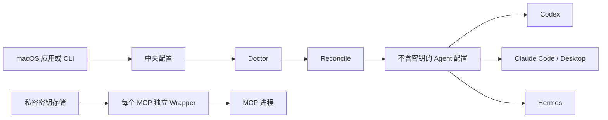

<p align="center">
  <a href="README.md">English</a> · <strong>简体中文</strong>
</p>

# Agent Switch

**每个 MCP 只定义一次，每个密钥只保存一次，再安全同步到所有支持的本地 AI Agent。**

[](https://github.com/JNHFlow21/agent-switch/actions/workflows/ci.yml)
[](https://www.apple.com/macos/)
[](LICENSE)

Codex、Claude Code、Claude Desktop 和 Hermes 都维护着各自的 MCP
配置。把相同的服务器与密钥复制到每个客户端，不仅容易产生配置漂移，也会让密钥散落在多个文件中。

Agent Switch 用一个本地 MCP 注册表、一个私密凭据存储和可重复生成的 Agent
配置替代这些副本。

> [!IMPORTANT]
> Agent Switch 目前仍是 **Alpha 软件**。当前安装器会在本机从源码构建，因此需要
> Xcode。正式面向用户的发行方式应当是经过 Developer ID 签名和 Apple 公证的
> GitHub Release，并通过 Homebrew Cask 安装。这个发行通道尚未完成，所以这里不会
> 放一个实际上不能使用的 `brew` 命令。

## 快速开始

### 前置条件

- macOS 14 或更高版本
- Git
- Python 3.11 或更高版本
- [`pipx`](https://pipx.pypa.io/)
- 包含 `xcodebuild` 的完整 Xcode

缺少命令行依赖时，可以运行：

```bash
brew install python pipx
```

### 安装

运行下面这一条经过验证的源码安装命令：

```bash
git clone https://github.com/JNHFlow21/agent-switch.git && cd agent-switch && ./scripts/install.sh
```

安装器会：

1. 检查 macOS、Python、pipx 和 Xcode；
2. 在独立的 pipx 环境中安装 Python CLI；
3. 构建原生应用并安装到 `~/Applications/Agent Switch.app`；
4. 仅在配置不存在时创建一个中立、空白的 Agent Switch 配置；
5. 打开应用，但不会自动接管 MCP，也不会改写原生 Agent 配置。

首次安装成功后应当看到：

```text
agent-switch --version  -> agent-switch 0.2.0
原生应用                  -> 从 ~/Applications/Agent Switch.app 打开
```

然后先预览已有的用户级 command/stdio MCP：

```bash
agent-switch mcp import --dry-run --json
agent-switch doctor
```

在执行 `agent-switch mcp import --adopt` 或 `agent-switch reconcile`
之前，请先检查检测到的 MCP ID、目标应用和所需密钥的**名称**。

<details>
<summary>为什么不使用 npm、NPX 或直接写一个 Homebrew 命令？</summary>

Agent Switch 是原生 macOS 应用加 Python CLI，Node.js 并不是它的运行时。
npm/NPX 只会引入无关依赖，最终仍然需要构建或下载 macOS 应用。

正确的用户发行链路应当是：

```text
签名并公证的发行产物 -> GitHub Releases -> Homebrew Cask
```

在这个产物真正存在之前，上面的源码安装器是最短且诚实的路径。详情见
[路线图](docs/roadmap.md)。

</details>

## 使用前后有什么变化

| 使用 Agent Switch 之前 | 使用 Agent Switch 之后 |
| --- | --- |
| 同一个 MCP 要分别配置到每个 Agent | 注册一次，再选择需要同步到哪些 Agent |
| API Key 被复制到多个原生客户端配置中 | 密钥值只保存在一个私密本地存储中 |
| MCP 修改后，不同客户端会悄悄产生漂移 | `doctor` 发现漂移，`reconcile` 修复漂移 |
| 每个 MCP 都可能继承完整的 Shell 环境 | 每个 Wrapper 只注入明确授权的密钥名称 |
| 迁移现有配置像一次不可控的大改动 | 先预览，再明确确认接管，并自动备份 |

新安装默认使用空注册表。Agent Switch 不会预装维护者喜欢的 MCP，也不会索取无关密钥。

## 核心工作流

```bash
# 1. 只预览支持的用户级 stdio MCP，不修改文件
agent-switch mcp import --dry-run --json

# 2. 备份原生配置，并明确接管预览过的 MCP
agent-switch mcp import --adopt

# 3. 通过本地管道写入密钥，不把值放进参数或聊天记录
secret-producing-command | agent-switch secret set --stdin SEARCH_API_KEY

# 4. 先检查健康状态与漂移，再应用中央配置
agent-switch doctor
agent-switch reconcile

# 5. 要求所有受管状态完全一致
agent-switch doctor --strict
```

不要在被记录的命令中用真实密钥替换 `secret-producing-command`。
macOS 应用是交互式录入密钥最简单的方式。

## Agent Switch 管理什么

| 领域 | 当前能力 |
| --- | --- |
| **MCP 服务** | 导入、新增、编辑、选择目标、启用、停用、删除并同步用户级 command/stdio MCP |
| **凭据** | 每个值只保存一次，每个 MCP 只能获得明确声明的密钥名称 |
| **Agent 策略** | 为 Codex、Claude Code 和 Hermes 同步有边界的指令块 |
| **健康检查** | 检测无效配置、缺失密钥名称、未固定版本的 `npx` 包、受阻目标和配置漂移 |
| **恢复** | 原子写入，并在迁移或替换原生文件前创建备份 |
| **CLI 清单** | 显示本机 AI 工具、版本、包管理器和可执行文件路径 |
| **Skills** | 读取可选的 Skill Hub 清单，但不会把“已下载”当成“已激活” |
| **CC Switch** | 保留 Provider 切换，只镜像 Agent Switch 自己拥有的 MCP 行 |

## 工作原理



| 本地事实来源 | 默认路径 |
| --- | --- |
| MCP 定义与授权 | `~/.config/agent-switch/config.json` |
| 凭据值 | `~/.config/agent-switch/secrets.env` |
| 生成的 MCP Wrapper | `~/.config/agent-switch/mcp/bin/` |
| 原生配置备份 | `~/.config/agent-switch/backups/` |

Agent Switch 只管理 `agent-*` MCP 条目和带标记的指令块。其他 Provider 与 MCP
设置会被保留。

## 支持的集成

| 集成 | MCP 同步 | 共享策略 | 状态清单 |
| --- | :---: | :---: | :---: |
| Codex | ✓ | ✓ | ✓ |
| Claude Code | ✓ | ✓ | ✓ |
| Claude Desktop | ✓ | — | — |
| Hermes | ✓ | ✓ | ✓ |
| CC Switch | 仅镜像自己拥有的行 | 保留 Provider 设置 | Schema 检查 |
| Skill Hub | Skill 清单/更新 | 显式项目或全局 Profile | ✓ |

新增 Agent 必须先实现并测试专用适配器。Agent Switch 不会猜测未知配置格式。

## 凭据与隐私边界

Agent Switch 是本地优先工具，但它**不是密码保险库**。

- 凭据值保存在本地 mode-`0600` 文件中，不进入 Git、应用偏好、生成的
  Agent 配置或 Wrapper 源码。
- 写入密钥使用 stdin 或继承的文件描述符，不使用位置参数。
- 读取密钥时拒绝 stdout、stderr、终端和别名描述符。
- Wrapper 把密钥文件当数据解析，移除继承的敏感变量，只注入当前 MCP
  获得授权的名称。
- 诊断、导入预览和审计只报告密钥**名称**，不报告值。
- 缺少必需密钥名称时，Wrapper 会关闭失败。
- 产品没有上传服务或云账户；但 Agent 调用某个 MCP 时，该 MCP 仍可能访问自己的服务商。

使用敏感凭据前，请阅读[密钥与 Wrapper](docs/secrets-and-wrappers.md)和
[安全策略](SECURITY.md)。安全问题应按照 `SECURITY.md` 的私密渠道报告，不要创建公开 Issue。

## 当前 Alpha 范围

0.2 版本管理 macOS 上用户级 command/stdio MCP 定义和静态凭据值。

目前尚未提供：

- 原生 HTTP/SSE Transport 或 OAuth Session 迁移；
- 项目级 MCP 发现；
- 对未知 Agent 的自动支持；
- 已签名并公证的可下载应用；
- 已发布的 Homebrew Cask 或 Python 包；
- 密码管理器或硬件保护的凭据保险库。

这些是明确限制，不是隐藏功能。计划中的工作记录在[路线图](docs/roadmap.md)中。

## 常用命令

```bash
agent-switch agents               # 检测到的 Agent 与策略接入状态
agent-switch clis                 # 已安装的 AI CLI 清单
agent-switch mcp list             # 中央 MCP 注册表
agent-switch secret list          # 只显示凭据名称
agent-switch skills               # 可选的 Skill Hub 清单
agent-switch doctor --json        # 机器可读的健康报告
agent-switch reconcile --dry-run  # 计划执行的受管变更
```

新增一个中央管理的 MCP：

```bash
agent-switch mcp add filesystem \
  --command npx \
  --arg=-y \
  --arg=@modelcontextprotocol/server-filesystem@1.0.0 \
  --app codex \
  --app claude

agent-switch reconcile
```

完整生命周期命令和安全导入行为见[统一 MCP 注册表](docs/mcp-registry.md)。

## 更新

在已经克隆的仓库中运行：

```bash
git pull --ff-only && ./scripts/install.sh
```

Agent Switch 不会静默更新自己、第三方 CLI 或 Skill 源。

## 文档

- [统一 MCP 注册表](docs/mcp-registry.md)
- [密钥与 Wrapper](docs/secrets-and-wrappers.md)
- [CC Switch 兼容性](docs/ccswitch-compat.md)
- [恢复与回滚](docs/recovery.md)
- [路线图](docs/roadmap.md)
- [参与贡献](CONTRIBUTING.md)
- [安全策略](SECURITY.md)

## 开发

```bash
git clone https://github.com/JNHFlow21/agent-switch.git
cd agent-switch
python3 -m venv .venv
. .venv/bin/activate
python -m pip install -e .
python -m unittest discover -s tests
python -m unittest discover -s tests/integration
```

原生应用位于 [`macos-app/AgentSwitch`](macos-app/AgentSwitch)，最低支持
macOS 14。完整测试和隐私门禁见 [CONTRIBUTING.md](CONTRIBUTING.md)。

## 许可证

[MIT](LICENSE) © 2026 JNHFlow21
