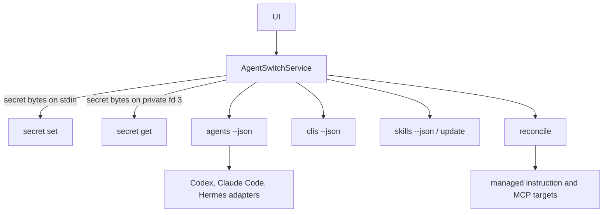

# Unified Agent, CLI, Skill, MCP, and Secret Control Surface

## Summary

Turn the existing macOS dashboard into an operational control surface: users can manage local secrets, inspect Agent takeover, see installed CLIs, browse the Skill Hub warehouse and activation state, update Git Skill sources, and open or reveal every displayed file path. Restyle the app to the supplied graphite-ink-on-warm-paper reference.

## Problem Frame

Agent Switch already generates shared instructions and reconciles MCP configuration, but the app exposes only read-only status. Secret changes still require the terminal, users cannot see how agent instruction takeover is applied, and first-run enrollment is not visible as a product workflow.

## Requirements

**Secret management**

- R1. The app can create and update any valid secret without placing its value in process arguments, environment variables, stdout, stderr, logs, or preferences.
- R2. The app masks secrets by default and reveals or hides them through a simple eye control without Touch ID or a system password dialog.
- R3. The app can copy a revealed secret through a normal explicit clipboard action.
- R4. The app can delete a secret after confirmation while preserving unrelated file content and private file permissions.
- R5. The secret inventory shows every stored secret name, not only names currently required by an MCP.

**Agent takeover**

- R6. The backend reports detection and instruction-management status for Codex, Claude Code, and Hermes without exposing secret values.
- R7. The app shows which supported agents are detected, managed, or need synchronization and identifies their instruction/config targets.
- R8. A first-run enrollment surface can reconcile every supported agent target after an explicit user action, preserving unrelated configuration and creating backups through existing atomic writers.
- R9. Later app refreshes detect newly installed supported agents and offer the same enrollment action.

**Visual system**

- R10. The app uses the supplied achromatic graphite-on-paper system: white main canvas, `#f9f9f9` sidebar, graphite text, hairline borders, no chromatic accents, no card shadows, 10-point control/card radii, compact 6/10/16/24 spacing, and system typography capped at 24 points.
- R11. Status is communicated with text, weight, monochrome fill, and icons rather than green, amber, red, or blue decoration.

**CLI, Skill, and files**

- R12. The app shows a live curated CLI inventory with installed state, version, manager, and executable path.
- R13. The app reads Skill Hub sources, locks, profiles, and available `SKILL.md` files without changing the Skill Hub working tree.
- R14. Skills are visibly classified as dormant, project-active, global, or missing; downloading/updating a source never activates its Skills.
- R15. Git Skill sources update only after an explicit user action through `skillctl fetch`.
- R16. Every meaningful file or directory path can be opened directly or revealed in Finder.

## Scope Boundaries

- This plan supports Codex, Claude Code, and Hermes only; future agents require an additional adapter.
- CLI inventory and Skill Hub inventory/update are included; automatic CLI mutation and scheduling remain a later release boundary.
- It does not synchronize conversation history or session context.
- Secret values remain in `~/.config/agent-switch/secrets.env`; this work does not migrate storage to Keychain.
- Enrollment remains explicit and reversible rather than silently modifying a newly detected agent.

## Key Technical Decisions

- **Keep Agent Switch Core as the authority:** the Swift app calls the existing Python CLI instead of parsing or rewriting secret/config files itself.
- **Use stdin for secret writes:** the app streams secret bytes into `secret set --stdin`; values never enter argv or the environment.
- **Use a private FIFO for reveal:** the app creates a mode-0600 FIFO in a private temporary directory and invokes `secret get --fd 3` with fd 3 redirected to that FIFO. Secret bytes never use stdout, stderr, argv, the environment, or a regular temporary file.
- **Keep reveal simple:** the eye button retrieves a value through the private FIFO and keeps it only in view state until the eye is clicked again or the user leaves the page.
- **Model agent support as adapters:** a backend registry owns detection paths and instruction/config targets. Management checks remain specific to each agent while returning one public JSON shape.
- **Reuse reconcile for enrollment:** enrollment does not invent a second writer. Existing managed blocks, atomic writes, backups, and preservation behavior remain the only mutation path.
- **Restyle through shared tokens first:** update `DSTokens.swift` and reusable components before feature views so every existing and new screen follows the reference consistently.

## High-Level Technical Design

## Implementation Units

### U1. Complete the safe secret backend contract

- **Goal:** Add deletion and complete inventory behavior while preserving the existing fd-only retrieval contract.
- **Files:** `src/agent_switch/security/secrets.py`, `src/agent_switch/cli.py`, `tests/test_secret_storage.py`, `tests/test_cli.py`, `docs/secrets-and-wrappers.md`.
- **Patterns:** Follow the current lock, validation, atomic-write, and redaction behavior in `security/secrets.py` and `cli.py`.
- **Test scenarios:** Delete an existing key; reject invalid/missing names; preserve comments and unrelated keys; keep mode 0600; list stored keys not referenced by MCP; prove no deleted or retained value reaches CLI output.
- **Verification:** Python unit suite and isolated CLI round trips pass.

### U2. Add supported-agent status adapters

- **Goal:** Expose one safe JSON report for Codex, Claude Code, and Hermes detection and instruction enrollment.
- **Files:** `src/agent_switch/agents.py`, `src/agent_switch/cli.py`, `tests/test_agents.py`, `tests/integration/test_reconcile_fixture_home.py`.
- **Patterns:** Reuse paths from `paths.py`, managed markers from `instructions.py`, and rendered-state comparison from `reconcile/doctor.py`.
- **Test scenarios:** No agent present; detected but unmanaged; managed and synchronized; managed block preserves user text; reconcile moves detected agents to managed state; JSON contains paths/status only.
- **Verification:** `agents --json` is deterministic and contains no secret values.

### U3. Build secure macOS secret operations

- **Goal:** Give the Swift service and app state safe create/update/reveal/delete operations.
- **Files:** `macos-app/AgentSwitch/AgentSwitch/Services/AgentSwitchService.swift`, `macos-app/AgentSwitch/AgentSwitch/Services/AppState.swift`, `macos-app/AgentSwitch/AgentSwitch/Models/AgentModels.swift`.
- **Patterns:** Extend the existing actor boundary and refresh-after-mutation flow.
- **Test scenarios:** Successful stdin write; validation failure; one-click FIFO reveal; missing secret; FIFO cleanup on success/failure; delete refresh; no secret included in surfaced error text.
- **Verification:** SwiftPM and Xcode builds pass; isolated backend round trips prove the transport contract.

### U4. Add Secrets and Agents product surfaces

- **Goal:** Replace the read-only secret page and add an agent takeover page with explicit enrollment.
- **Files:** `macos-app/AgentSwitch/AgentSwitch/Features/Secrets/SecretsView.swift`, `macos-app/AgentSwitch/AgentSwitch/Features/Agents/AgentsView.swift`, `macos-app/AgentSwitch/AgentSwitch/Navigation/SidebarView.swift`, `macos-app/AgentSwitch/AgentSwitch/ContentView.swift`, `macos-app/AgentSwitch/AgentSwitch/Resources/L10n.swift`, `macos-app/AgentSwitch/AgentSwitch.xcodeproj/project.pbxproj`.
- **Patterns:** Reuse the existing navigation and shared page/card components; mutations route through `AppState` only.
- **Test scenarios:** Add/update sheet validation; masked/revealed toggle; normal copy; delete confirmation; detected/unmanaged/managed agent rows; enrollment action; empty and error states.
- **Verification:** Both build systems compile the new feature file and the app launches without startup failure.

### U5. Apply the graphite-on-paper design system

- **Goal:** Make all existing and new screens conform to the supplied style reference.
- **Files:** `macos-app/AgentSwitch/AgentSwitch/DesignSystem/Tokens/DSTokens.swift`, `macos-app/AgentSwitch/AgentSwitch/DesignSystem/Components/DSComponents.swift`, existing files under `macos-app/AgentSwitch/AgentSwitch/Features/`, and `macos-app/AgentSwitch/AgentSwitch/Navigation/SidebarView.swift`.
- **Patterns:** Central semantic tokens and reusable components remain the only source for color, typography, spacing, radius, border, and elevation.
- **Test scenarios:** No chromatic token remains in app chrome; no shadow modifier remains on cards; headings stay at or below 24 points; cards/buttons use 10-point radius; sidebar/main surfaces and hairlines match the reference.
- **Verification:** Source scan enforces forbidden color/shadow patterns and visual inspection confirms hierarchy, density, and modal treatment.

### U6. Document onboarding and run final gates

- **Goal:** Document how takeover and secret UI work and validate the complete path without touching live secret values.
- **Files:** `README.md`, `docs/secrets-and-wrappers.md`, `docs/recovery.md`, tests as needed.
- **Test scenarios:** Fixture-home onboarding preserves unrelated config; second reconcile is idempotent; secret set/get/delete uses synthetic values only; agent status converges; docs describe supported-agent boundaries and UI authentication.
- **Verification:** Python unit and integration suites, `swift build`, `xcodebuild`, secret/path scan, `git diff --check`, and a fixture-home doctor/reconcile cycle all pass.

### U7. Add CLI, Skill Hub, and path surfaces

- **Goal:** Make CLIs and stored Skills visible without activating or mutating them implicitly, and make displayed paths actionable.
- **Files:** `src/agent_switch/cli_inventory.py`, `src/agent_switch/skill_inventory.py`, CLI wiring/tests, Swift models/service/state, `Features/CLIs`, `Features/Skills`, and shared path actions.
- **Test scenarios:** installed/missing CLI; version timeout; dormant/project/global/missing Skill; explicit-only Skill update; open/reveal path controls; Xcode and SwiftPM source inclusion.
- **Verification:** inventory JSON decodes in Swift, Skill Hub remains unchanged during read-only refresh, and both app builds pass.

## Acceptance Examples

- AE1. Given a missing `DEMO_API_KEY`, when the user enters it in the app, then the stored file remains private, no process output contains the value, and the inventory shows it as configured.
- AE2. Given an existing key, when the user clicks the eye button, then the value appears without system authentication and stays visible until explicitly hidden or the page is left.
- AE3. Given a second eye-button click, the visible value is immediately masked again.
- AE4. Given Codex is installed but its instruction pointer is absent, when the user chooses “Manage detected agents,” then reconcile backs up the existing config, installs the pointer, and the next agent report shows managed.
- AE5. Given a newly installed supported agent, when the app refreshes, then it appears as detected and unmanaged without being modified until enrollment is confirmed.

## Risks and Dependencies

- FIFO reveal must avoid deadlock and clean up private temporary paths after cancellation or process failure.
- Secret reveal is intentionally convenient rather than system-authenticated; the private transport boundary still prevents accidental argv/stdout/stderr leakage.
- Xcode and SwiftPM maintain separate source inclusion behavior, so new feature files must be added to the Xcode project and verified in both builds.
- Existing user configuration must remain outside managed blocks; fixture integration tests are the release gate for this invariant.
